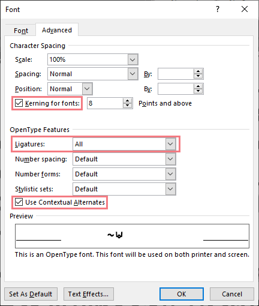
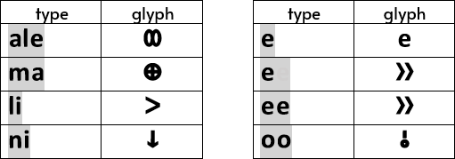
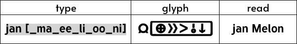
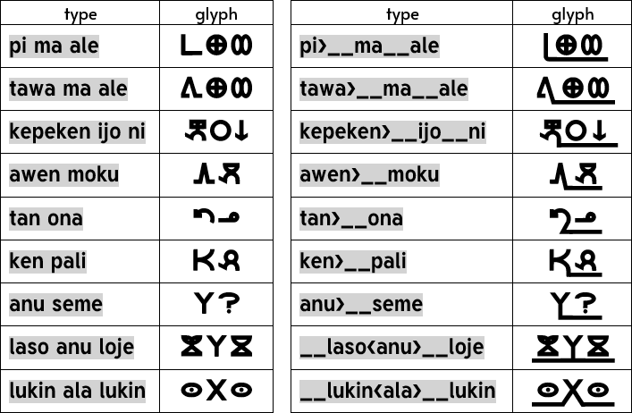

# linja wawa
*Linja wawa* is a [*sitelen pona*](https://en.wikipedia.org/wiki/Toki_Pona#sitelen_pona) font made by [nimi Elemenopi](https://www.reddit.com/user/ElemenopiTheSequel/) &amp; [jan Melon](https://www.reddit.com/user/just-a-melon). *Sitelen pona* is a writing system for the conlang *toki pona* which was created by Sonja Lang. This font is released under the [SIL Open Font License](https://scripts.sil.org/cms/scripts/page.php?site_id=nrsi&id=OFL) which means it can be used, studied, modified and redistributed freely as long as they are not sold by themselves (see the OFL.txt file for the full license). The initial glyph designs were made by nimi Elemenopi in 2019 but was only made into an installable font in 2021.

## Setting up the Font
After installing the font, turn on Kerning, all Ligatures, and the "use Contextual Alternates" option. In MS Word, you can find this option by either right-clicking and then selecting "font" or by pressing Ctrl+D. 

## Using the Font
### Typing Basic Words
When you type a *toki pona* word, it will be automatically converted to its sitelen pona glyph. E.g. if you type the word "ale", then it will be converted to sitelen pona glyph for "ale" which looks like an infinity sign ⟨∞⟩. Currently, all *pu* words and *ku suli* words are available in this font.

One-letter *toki pona* words, like "a", "e", and "o" will only be converted into their "sitelen pona* glyphs if you add a space after it or if you type the same letter twice. Otherwise, it will only show as a latin character. E.g. typing "e" will result in the latin character ⟨e⟩, but typing "e " or "ee" will give you its *sitelen pona* glyph which looks like a sideway double-chevron ⟨»⟩.

### Name Cartouche
Names in *toki pona* are written by putting glyphs inside a cartouche. The first sound of each glyph spells out how the name is pronounced. To start a cartouche, type a left square bracket ⟨&#91;⟩. Then, type an underscore ⟨&lowbar;⟩ to make the upper and lower lines of cartouche. Now you can type any sitelen pona glyph and it will automatically be put inside the cartouche. To close the cartouche, type a right square bracket ⟨&#93;⟩. E.g. "jan Melon" can be written as "jan &#91;&lowbar;ma&lowbar;ee&lowbar;li&lowbar;oo&lowbar;ni&#93;".

### Extra Features
Some words, like "pi" and "tawa" can become containers for other words. Type a greater-than sign ⟨&gt;⟩ after the container word, e.g. "pi>", and then type two underscores ⟨&lowbar;&lowbar;⟩ to create an underline that extends the container glyph so that other words can be placed on it.

